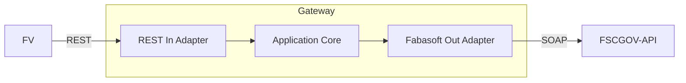

# Building Block View

## Whitebox Overall System

The API gateway is structured in hexagonal architecture and consists of following base components

### REST In Adapter

Implements the OpenAPI-Spec-REST-API and calls core methods with domain objects.

### Fabasoft Out Adapter

Implements outgoing core methods by using the FSCGOV-SOAP-API.

### Application Core

Defines all ports between the adapters and the core and implements the business logic.

### Domain

Holds all domain objects which are used across the application but are owned by the core.
This decouples the adapters and allows them to be switched out or adding different implementations.
